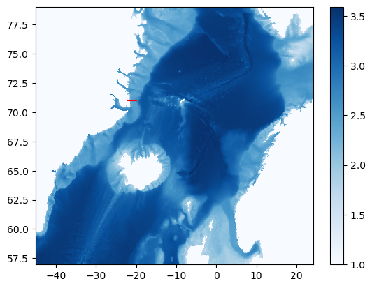
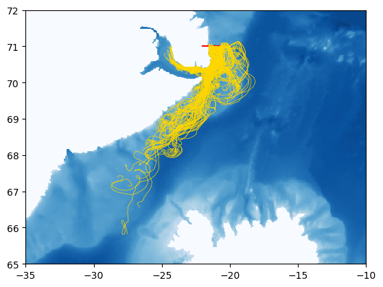

______________________________________________________________________

## jupytext: text_representation: extension: .md format_name: myst format_version: 0.13 jupytext_version: 1.14.5 kernelspec: display_name: Python 3 (ipykernel) language: python name: python3

# Lagrangian particle demonstration in a regional MITgcm configuration without faces and with open boundaries.

### Wenrui Jiang, Tom Haine Feb '23

> :warning: the notebook was last ran on 2023-05-22. You can find the executable version at https://github.com/MaceKuailv/seaduck_sciserver_notebook/blob/master/IGP.ipynb.

```{code-cell} ipython3
import matplotlib.pyplot as plt
import numpy as np
import oceanspy as ospy

import seaduck as sd
```

### The regional MITgcm run is the IGPwinter simulation, available on SciServer. The simulation is opened using the OceanSpy package.

### See: https://oceanspy.readthedocs.io/en/latest/datasets.html#igpwinter and https://dev-poseidon-ocean.pantheonsite.io/products/datasets/.

```{code-cell} ipython3
od = ospy.open_oceandataset.from_catalog("IGPwinter")
```

### Artificially create an open boundary in depth.

```{code-cell} ipython3
ds = od._ds.isel(Z=slice(0, 50), Zl=slice(0, 50))
```

### Initialize OceInterp package.

```{code-cell} ipython3
oce = sd.OceData(ds)
```

### Initialize the particles: We put the ducks on the East Greenland continental shelf...

```{code-cell} ipython3
Nx = 20
Nz = 10
x = np.linspace(-22, -20, Nx)
z = np.linspace(0, -200, Nz)
x, z = np.meshgrid(x, z)
x = x.ravel()
z = z.ravel()
y = np.ones_like(x) * 71.0
```

### ...and at the beginning of the simulation...

```{code-cell} ipython3
start_time = "2018-01-02"
t = (
    np.array([np.datetime64(start_time) for i in x]) - np.datetime64("1970-01-01")
) / np.timedelta64(1, "s")
```

### ...and integrate forward in time for one month.

```{code-cell} ipython3
tf = (np.datetime64("2018-02-01") - np.datetime64("1970-01-01")) / np.timedelta64(
    1, "s"
)
```

### Here is where the particles start on the map:

```{code-cell} ipython3
plt.pcolormesh(od._ds["XC"], od._ds["YC"], np.log10(od._ds["Depth"] + 10), cmap="Blues")
plt.plot(x, y, "r")
plt.colorbar()
plt.show()
```



### Define a function to control when to continue simulation, or to stop it. The simulation will only continue for particles that return True.

#### This function filters particles based on their geographic position.

```{code-cell} ipython3
def continue_criterion(pt):
    x_ = np.logical_and(pt.lon < 0, pt.lon > -43)
    y_ = np.logical_and(pt.lat < 77.5, pt.lat > 57.5)
    z_ = pt.dep > -750
    return np.logical_and(np.logical_and(x_, y_), z_)
```

### Use volume flux (transport) to advect the particles. This is usually better than using the velocity field itself.

```{code-cell} ipython3
oce["utrans"] = oce["U"] * oce["drF"] * oce["dyG"]
oce["vtrans"] = oce["V"] * oce["drF"] * oce["dxG"]
oce["wtrans"] = oce["W"] * oce["rA"]
```

### Create the particle object.

```{code-cell} ipython3
p = sd.particle(
    x=x,
    y=y,
    z=z,
    t=t,
    data=oce,
    continue_criterion=continue_criterion,
    uname="utrans",
    vname="vtrans",
    wname="wtrans",
    # save_raw = True,
    transport=True,
)
```

### Perform the particle trajectory simulation.

```{code-cell} ipython3
stops, raw = p.to_list_of_time([t[0], tf])
```

### Retrieve the particle positions from the `seaduck.eulerian.position` objects.

```{code-cell} ipython3
lons = np.array([pt.lon for pt in raw])
lats = np.array([pt.lat for pt in raw])
```

### Plot results.

```{code-cell} ipython3
plt.pcolormesh(od._ds["XC"], od._ds["YC"], np.log10(od._ds["Depth"] + 10), cmap="Blues")
plt.plot(x, y, "r")
plt.plot(lons, lats, "gold", lw=0.5)
plt.xlim([-35, -10])
plt.ylim([65, 72])
plt.show()
```



```{code-cell} ipython3

```
